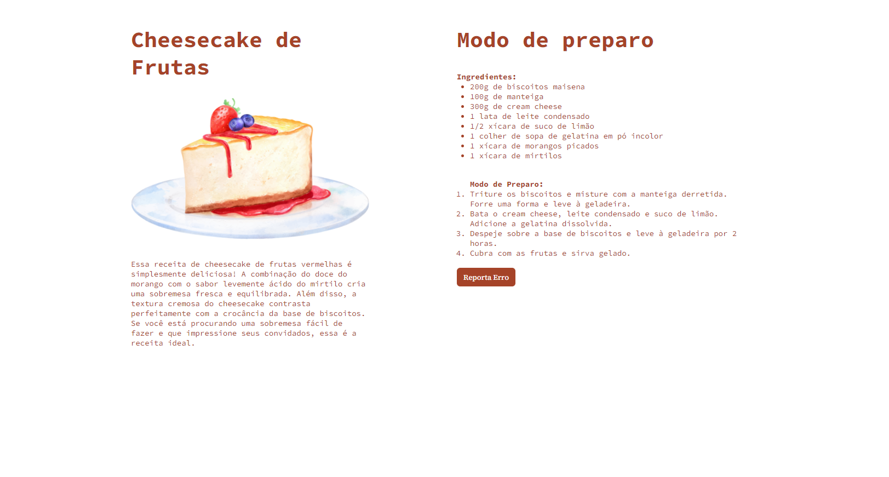
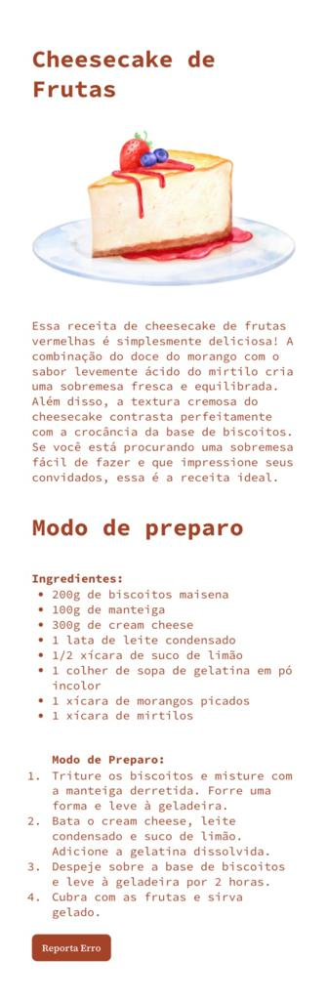

<h1 align="center"> Desafio Responsividade</h1>

Programa exclusivo do Bruno Bianchi, para ensino de tecnologias WEB.  
Desafio proposto pela Rocketseat, com objetivo de utilizar o recurso de responsividade. 

  <a href="#-tecnologias">Tecnologias</a>&nbsp;&nbsp;&nbsp;|&nbsp;&nbsp;&nbsp;
  <a href="#-projeto">Projeto</a>

  

  

 

## 🚀 Tecnologias

Esse projeto foi desenvolvido com as seguintes tecnologias:

- HTML e CSS
- Git e Github

## 💻 Projeto

O Desafio é utlizar o recurso de responsividade!

- [Acesse o projeto finalizado, online](https://brunobianchi13.github.io/Desafio-Resposividade/)

---

Feito by Bruno Bianchi

